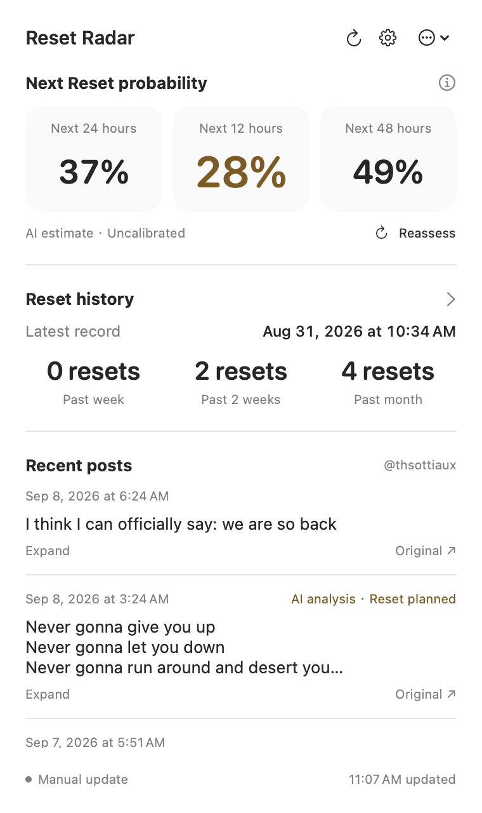
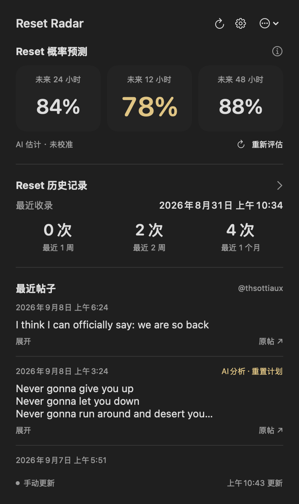
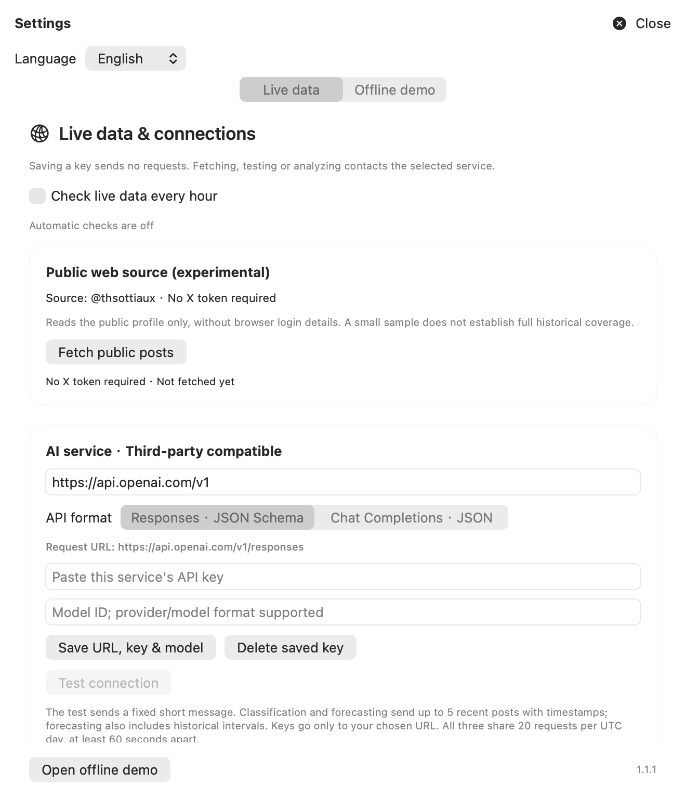

<div align="center">
  
  <h1>Reset Radar</h1>
  <p>Watch for the next Codex Reset from your macOS menu bar.</p>
  <p>Public posts · AI probability estimates · Community history</p>
</div>

English · [简体中文](README.zh-CN.md)

Reset Radar is an independent macOS menu bar app. It reads public announcements, analyzes recent posts through your chosen AI provider, and estimates the probability of a global usage reset in the next 12 / 24 / 48 hours.

**These are experimental, uncalibrated estimates.** The app cannot read your personal Codex allowance or guarantee an account reset. This project is not affiliated with or endorsed by OpenAI.

## Download

[Download v1.1.1 DMG](https://github.com/ly918/reset-radar/releases/download/v1.1.1/Reset-Radar-1.1.1-macOS-arm64.dmg) · [SHA-256 checksum](https://github.com/ly918/reset-radar/releases/download/v1.1.1/Reset-Radar-1.1.1-macOS-arm64.dmg.sha256) · [Release notes](https://github.com/ly918/reset-radar/releases/tag/v1.1.1)

Requires **Apple Silicon and macOS 14+**. Open the DMG, drag **Reset Radar.app** into **Applications**, then launch it and click its menu bar icon. Intel, Windows and iOS builds are not available.

The app is currently ad-hoc signed, without Apple Developer ID signing or notarization. macOS may require confirmation in **System Settings → Privacy & Security** when opening an externally downloaded copy.

## Features

- **Multilingual interface:** English by default, with Simplified Chinese in **Settings → Language**. Your choice is saved and applies immediately.
- **Reset probabilities:** 24h / 12h / 48h cards, with 12h centered in gold. The menu bar icon and number follow the valid 12h estimate.
- **AI post analysis:** Up to 5 recent posts, timestamps and missing-context flags go to your chosen provider. Labels such as “AI analysis · Reset planned” come from model classification, with expandable evidence.
- **Community history:** Latest recorded direct Reset announcement and counts over the past 7 / 14 / 30 days. Announcement time is not independently verified account delivery time.
- **Third-party providers:** Base URL + API key + model ID, with compatible Responses or Chat Completions endpoints.
- **Native appearance:** Clear Liquid Glass with a readability layer on macOS 26; system blur on earlier versions. Adapts to light/dark appearance and Reduce Transparency.
- **Local storage:** Keys stay in macOS Keychain. Settings, cached posts and analysis remain on your Mac. Optional hourly checks.

## Screenshots

<p align="center">
  
  
</p>

<details>
<summary>Settings and language selection</summary>



</details>

Rendered from the application's own views. The main panel shows public posts and model estimates saved on September 8, 2026, not live probabilities. Settings use an empty default configuration. Static previews exclude the desktop; actual glass appearance depends on the content behind the window.

## Setup

1. Open **Settings**; optionally choose **简体中文** under **Language**.
2. Enter your AI service URL, key and model ID. Choose a compatible API format, save and test the connection.
3. Fetch public posts, analyze them and assess Reset probability. Enable hourly checks if desired.

Posts come from the public `x.com/thsottiaux` profile. No X token or browser cookies are required. Access restrictions, page changes and missing context may prevent retrieval or leave gaps.

New AI explanations use the selected language; source posts and evidence stay verbatim. Saved explanations keep their original language. Changing language does **not** rerun analysis or spend API allowance.

Connection tests, classification and forecasts share **20 requests per UTC day**, at least **60 seconds apart**. Failed calls also count; your provider may charge for requests. Unchanged posts reuse saved analysis. No polling occurs while the app is closed or the Mac is asleep. Login startup and system notifications are not configured.

## Build and verify

Use macOS with Swift 6.2+ / the corresponding Command Line Tools or Xcode, plus Python 3. A macOS 26 SDK is needed to compile native Liquid Glass support; the app's deployment target is macOS 14. No third-party Swift dependencies are required.

```sh
git clone git@github.com:ly918/reset-radar.git
cd reset-radar
./scripts/check.sh
./scripts/build-demo.sh
open 'build/Reset Radar.app' --args --show-panel
```

```sh
./scripts/package-dmg.sh
```

Packaging validates the DMG, signature and copied application's windows and localization resources. Outputs go to `dist/`, outside Git. Pushing a version-matching `vX.Y.Z` tag triggers GitHub Actions to check, build and publish the DMG and checksum. Release notes live in `docs/releases/vX.Y.Z.md`.

## Data and privacy

- API keys are scoped to the service URL in Keychain and sent only to that endpoint. No keys or personal settings are included in the repository or installer.
- AI receives public posts; forecasts also receive the current time, historical intervals and parsed reset-plan timing.
- Local data lives in `~/Library/Application Support/ResetRadar/Shadow/`. There is no telemetry SDK or project-operated data upload service.
- The bundled archive contains 50 community entries as of **2026-09-07**. Updating that archive requires importing a new source snapshot; hourly checks do not update it.
- Demo scenarios use separate synthetic data and never become real forecast evidence.

[Privacy](docs/privacy.md) · [Data provenance](data/provenance.md) · [Third-party data](data/LICENSE-DATA.md)

## Project layout

```text
apps/macos/         SwiftUI + AppKit client and localization resources
packages/RadarCore/ Fetching, model calls, validation, forecasting and tests
scripts/            Build, packaging, validation and import tools
prompts/            Post classification prompt
schemas/            Classification contract
data/               Community metadata and provenance
docs/               Architecture, release notes, screenshots and branding
```

[Architecture](docs/architecture.md) · [Contributing](CONTRIBUTING.md) · [Changelog](CHANGELOG.md)

## Roadmap

- Developer ID signing, notarization and automatic updates.
- Better archive updates, coverage verification and forecast backtesting.
- More resilient public-page retrieval.
- Evaluate a Windows client before offering EXE / MSI installers.

## License

Original code, documentation and logo are available under the [MIT License](LICENSE). Third-party metadata and source content are described separately; MIT does not grant rights to third-party websites, posts or trademarks.
