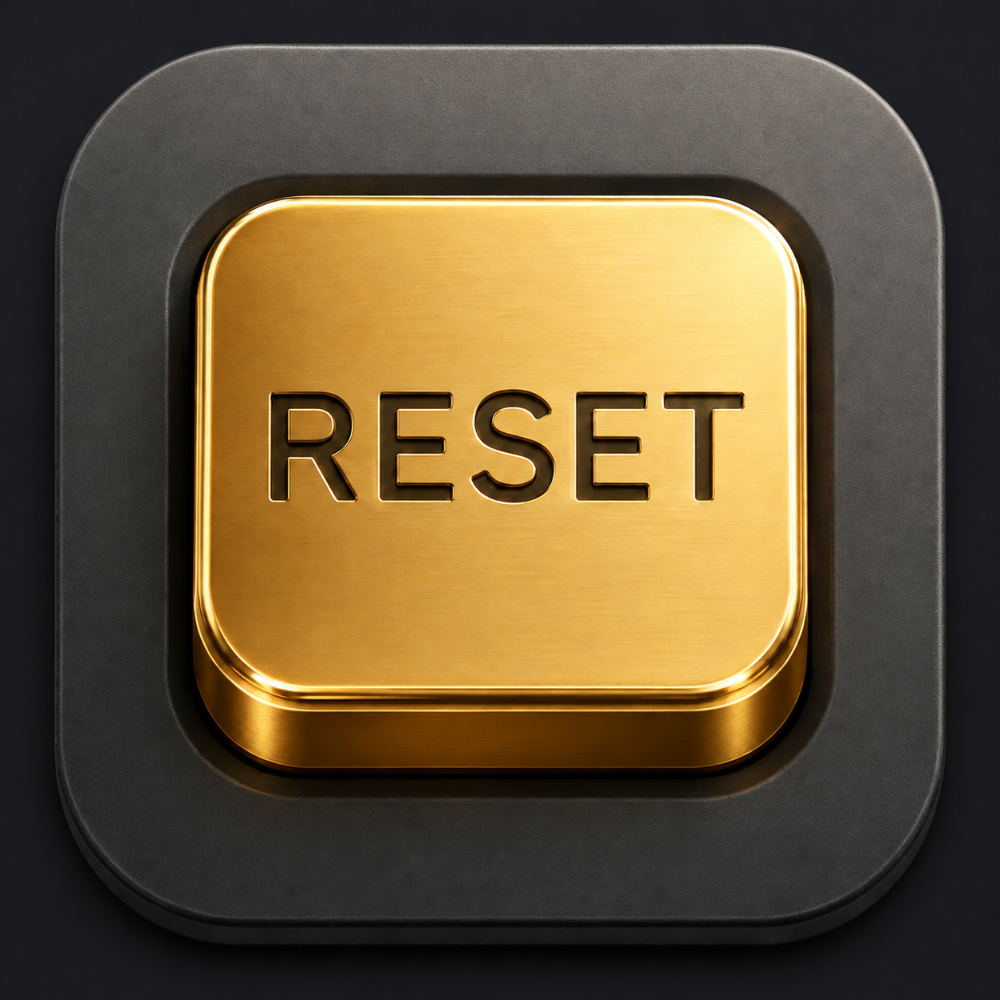
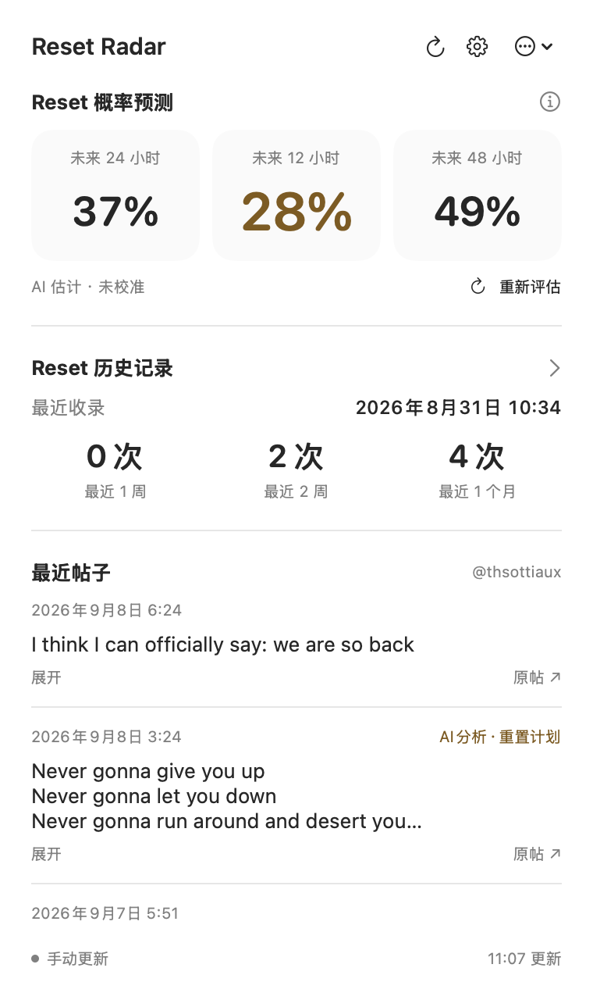
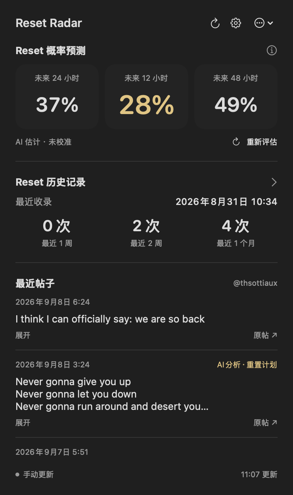
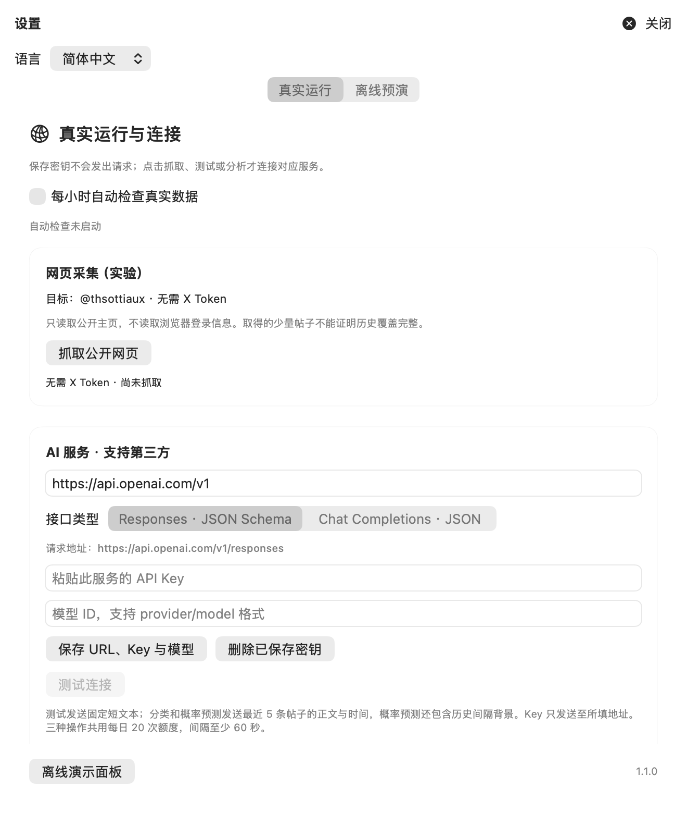

<div align="center">
  
  <h1>Reset Radar</h1>
  <p>在 macOS 菜单栏，关注下一次 Codex Reset。</p>
  <p>真实公开帖子 · AI 概率估计 · 社区历史记录</p>
</div>

Reset Radar 是一个独立的 macOS 菜单栏应用：读取公开公告，调用你配置的 AI 服务分析最近帖子，并估计未来 12 / 24 / 48 小时发生全局用量重置的概率。

**这是实验性估计，尚未回测校准。** 应用无法读取你的个人 Codex 额度，也不保证某个账号会重置。项目与 OpenAI 没有隶属或官方合作关系。

[English](README.md) · 简体中文

## 功能

- **多语言**：默认英文，可在 Settings → Language 中切换简体中文并即时生效，选择保存在本机。
- **概率预测**：主面板从左到右显示 24h、12h、48h；12h 居中、金色突出。菜单栏图标和数字随有效的 12h 概率变化。
- **真实帖子分析**：将最近最多 5 条帖子的完整抓取正文、发布时间和上下文缺失标记交给 AI。标签如“AI分析·重置计划”来自模型分类，可展开查看理由与原文证据。
- **历史记录**：显示最近收录的直接 Reset 公告时间，以及近 7 / 14 / 30 天的收录次数。历史来自公开社区归档，不等于已独立核验的实际到账记录。
- **第三方 AI**：支持 Base URL + API Key + 模型 ID，以及 Responses / Chat Completions 两类兼容接口。
- **原生材质**：macOS 26 使用 Clear Liquid Glass 配合可读性衬底；旧系统使用系统模糊。自适应深浅色与降低透明度设置。
- **本机运行**：密钥存储于 macOS Keychain；配置、帖子缓存和分析结果保存在本机。可启用每小时自动检查。

## 应用截图

主面板：12h 概率居中突出，历史统计与最近帖子分区展示。

<p align="center">
  
  
</p>

<details>
<summary>查看设置页</summary>



</details>

截图由应用自身视图渲染。主面板为 2026-09-08 的公开帖子与当时模型估计，不是实时概率；设置页使用空白默认配置。静态截图不包含桌面，实际玻璃材质会随窗口后方内容变化。

## 平台与下载

| 平台 | 当前状态 |
| --- | --- |
| macOS · Apple Silicon | 提供 v1.1.2 `.dmg`；要求 macOS 14+，已在 macOS 26 验证 |
| macOS · Intel | 尚未构建或验证，不提供 Intel 下载包 |
| Windows | 尚无客户端或 EXE 安装包 |
| iOS | 尚无客户端 |

[下载 v1.1.2 DMG](https://github.com/ly918/reset-radar/releases/download/v1.1.2/Reset-Radar-1.1.2-macOS-arm64.dmg) · [SHA-256 校验文件](https://github.com/ly918/reset-radar/releases/download/v1.1.2/Reset-Radar-1.1.2-macOS-arm64.dmg.sha256) · [Release 说明](https://github.com/ly918/reset-radar/releases/tag/v1.1.2)

DMG 安装：打开镜像，将 **Reset Radar.app** 拖入 **Applications**，再从“应用程序”启动。应用常驻屏幕顶部菜单栏，点击图标打开面板。

目前构建脚本使用本地 ad-hoc 签名，尚未进行 Apple Developer ID 签名和公证。外部下载的版本首次打开可能受到 macOS 安全校验限制。

## 从源码运行

准备 macOS、Swift 6.2+ / 对应 Command Line Tools 或 Xcode，以及 Python 3。构建包没有第三方 Swift 依赖；macOS 26 SDK 用于编译原生 Liquid Glass API，程序最低运行版本为 macOS 14。

```sh
git clone git@github.com:ly918/reset-radar.git
cd reset-radar
./scripts/build-demo.sh
open 'build/Reset Radar.app' --args --show-panel
```

1. 在 Settings → Language 中按需选择简体中文，然后填写 AI 服务 URL、Key 和模型 ID，并选择兼容接口。
2. 保存后测试连接，再抓取公开帖子、分析帖子和评估概率。
3. 按需开启“每小时自动检查真实数据”。

帖子来自 `x.com/thsottiaux` 的公开页面，不要求填写 X Token 或浏览器 Cookie。页面结构、访问限制和上下文缺失都可能导致获取失败或信息不完整。

新发起的 AI 分析按所选语言返回解释，帖子原文及证据不翻译；已保存的解释保留原语言，切换语言不会自动重跑分析或消耗额度。

AI 分类、连接测试、概率评估共享每日 20 次请求额度（UTC 日界），最小间隔 60 秒，失败也计入预算；调用服务可能收费。新帖、正文或模型配置变化时重新分类，相同正文复用已有结果。应用退出或电脑休眠时不轮询，不会自动配置登录启动。

## 数据与隐私

- API Key 按服务地址存入 macOS Keychain，只向配置的服务发送；不打包进安装包，也不写入仓库。
- AI 服务收到公开帖子；概率评估还会收到当前时间、历史间隔背景和可解析的计划时间信息。
- 本机数据位于 `~/Library/Application Support/ResetRadar/Shadow/`；仓库不包含个人配置、缓存或真实请求日志。
- 社区历史快照目前为 **2026-09-07** 的 50 条归档，更新源码快照需要重新导入；每小时检查不会自动更新该历史归档。
- Demo 是独立的合成数据，不参与真实预测。未接入系统通知。

详见 [隐私说明](docs/privacy.md)、[数据出处](data/provenance.md) 和 [第三方数据说明](data/LICENSE-DATA.md)。

## 开发与验证

```sh
./scripts/check.sh          # 核心断言与合成分类契约
./scripts/build-demo.sh     # Release .app
./scripts/package-dmg.sh    # DMG、SHA-256、挂载与复制后启动自检
```

DMG 输出到 `dist/`，不提交到 Git 历史。推送与应用版本一致的 `vX.Y.Z` 标签后，GitHub Actions 会执行检查、构建并发布 DMG 与 SHA-256 到 Release。发布说明存放在 `docs/releases/vX.Y.Z.md`。

```text
apps/macos/       SwiftUI + AppKit 菜单栏客户端
packages/RadarCore/  数据采集、模型调用、分类校验、预测与测试
scripts/          构建、打包、校验和数据导入
config/           不含密钥的默认配置与数据源元信息
prompts/          帖子分类提示词
schemas/          分类结果契约
data/             社区事实元数据、出处与限制
docs/brand/       Logo 与应用图标来源
```

[架构说明](docs/architecture.md) · [贡献指南](CONTRIBUTING.md) · [变更记录](CHANGELOG.md) · [v1.1.2 发布说明](docs/releases/v1.1.2.md)

## 路线图

- 完善 Developer ID 签名、公证与自动更新。
- 完善历史归档更新、数据覆盖核验和概率回测。
- 改进公开网页获取的稳定性与来源覆盖。
- 评估 Windows 客户端，再提供独立的 EXE / MSI 安装包。

## 许可

本项目原创代码、文档和 Logo 采用 [MIT License](LICENSE)。第三方事实元数据与其来源内容单独说明，MIT 不授予第三方网站、帖子或商标的权利。

### 钥匙串弹窗

启动和自动检查静默读取凭据。若 macOS 要求授权，AI 请求会暂停，面板显示“AI 密钥需要授权”；公开帖子和已保存分析仍可查看。准备好后点击“授权并评估”，或在设置中点击“测试连接”。成功读取的密钥仅在本次应用进程内复用。

确认信任应用后，可在系统提示中选择“始终允许”。当前安装包使用临时签名，更新为新构建后可能仍需再次授权。本次修复避免后台主动弹窗，不会移除钥匙串访问控制或把密钥改存为明文。
